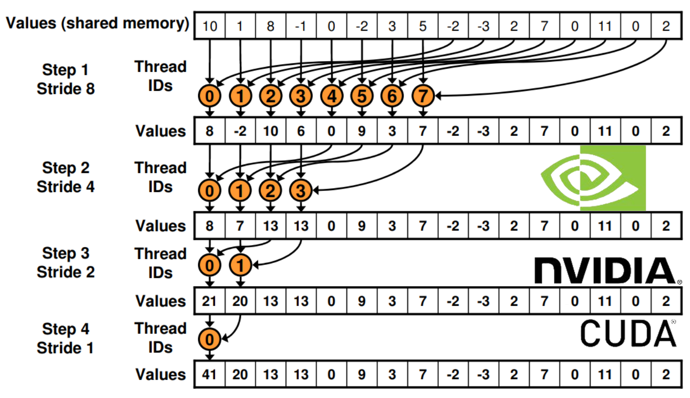

# parallel-prog

This repository has some projects related to Parallel and Concurrent programming, using the *pthreads* library in C and C++, *OpenMP* library and **CUDA** for parallel execution in Nvidia GPU's.

### *Projects*

- *frog-puzzle*

    Implementation of the famous [Jumping frog puzzle](https://primefactorisation.com/frogpuzzle/), when each frog is represented as a **thread**. This project isn't a solver of the puzzle (that can easily be solved using classical search), but is to represent a system of independent agents interacting at the same time with a shared environment. The project make use of *mutexes* and a *synchronization barrier* to maintain control of the frogs.

    
 

- *hyperthreading*

    In this experiment we show that Hyper-threading is not a silver bullet. The code is specificaly designed to run slower when the [Hyper-threading](https://en.wikipedia.org/wiki/Hyper-threading) is active. You can see [here](https://www.golinuxhub.com/2018/01/how-to-disable-or-enable-hyper.html) how to toggle hyperthread on your computer. The routine is mainly using write operations to keep the HD device busy. We tested the code in a Intel Core i7-5500U CPU.

    
 

- *parallel-matrix-mult*

    This project is meant to show two parallelization techniques in the matrix multiplication problem, and how this problem can be optimized with parallelization. The first approach taken is using [Block matrix multiplication](https://en.wikipedia.org/wiki/Block_matrix#Block_matrix_multiplication), by assigning each block to a specific thread, then multiplying the blocks in parallel by using cache blocking to optimize the memory access, all of this using the Pthreads library. The other technique used is to optimize the matrix multiplication by rearranging the loops of the default algorithm, and adding OpenMP directives to parallelize the code. The report of the project (inside the folder) has more details about each approach, as well as a comparison between them.

    
 

- *cuda-reduce*

    This project aims to utilize CUDA to run a parallel routine on the GPU, and analyzing it's performance. The problem we used is a reduction problem, specifically, a minimization problem over 9x9 matrices. The result should be a single 9x9 matrix where each entry is the minimum of all the numbers in the same entry in the N matrices. We implemented a CUDA Kernel in C++, using the Sequential Addressing technique in the GPU, which is shown in the image below. More techniques regarding Reduction problems techniques using CUDA can be found [here](https://developer.download.nvidia.com/compute/cuda/1.1-Beta/x86_website/projects/reduction/doc/reduction.pdf).

    
 

### *Miscelaneous/experiments*

- *missionaries.py*

    Solves the classical Missionaries and Cannibals puzzle, using a BFS search.

    
 

- *zero_sum_game.py*

    Obtain the equilibrium of a two-player zero sum game (if it has one), and find the optimal (pure) strategy for both players.

 

